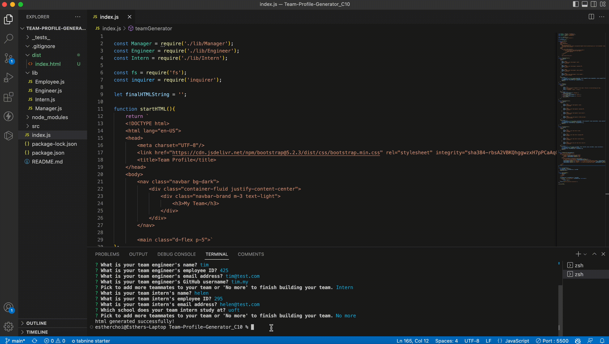

  # Team Profile Generator C_10
  
  ## Description
  This project was to create a node.js command-line application that takes in information about employees and generates an HTML webpage with the user input.

  ## Table of Contents
  1. [ Installation Instructions ](#installationInstructions)
  2. [ Mock Up ](#mockUp)
  3. [ Usage ](#usage)
  4. [ Contributions ](#contributions)
  5. [ Test Instructions ](#testInstructions)
  6. [ License ](#license)

  
  ## Installation Instructions
  To access this project, you can click on the GitHub URL below and clone the repository to access locally. 

  https://github.com/yerimechoi/Team-Profile-Generator_C10

  
  ## Mock Up
  The following shows the creation of a README file through node js. 
  

  
  ## Usage
  Enter "node index.js" in your command-line to create your team profile.
  

  
  ## Contributions
  N/A

  
  ## Test Instructions
  Enter "npm run test" in your command-line to test out the classes.
  

  
  ## License
  N/A